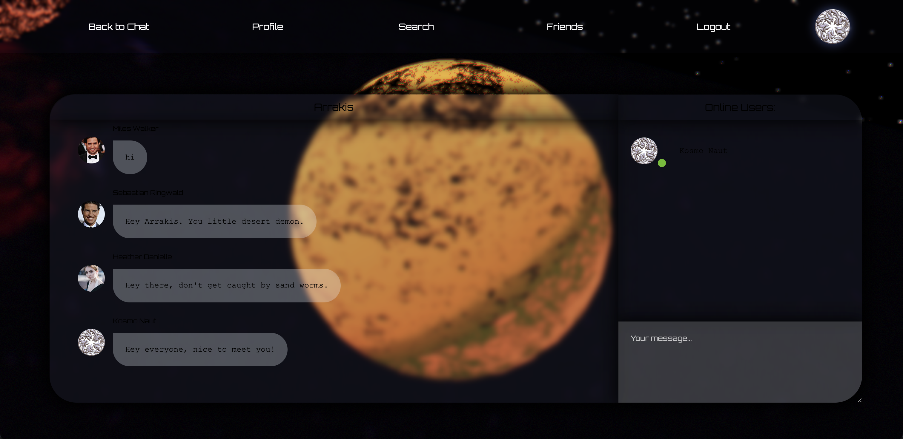
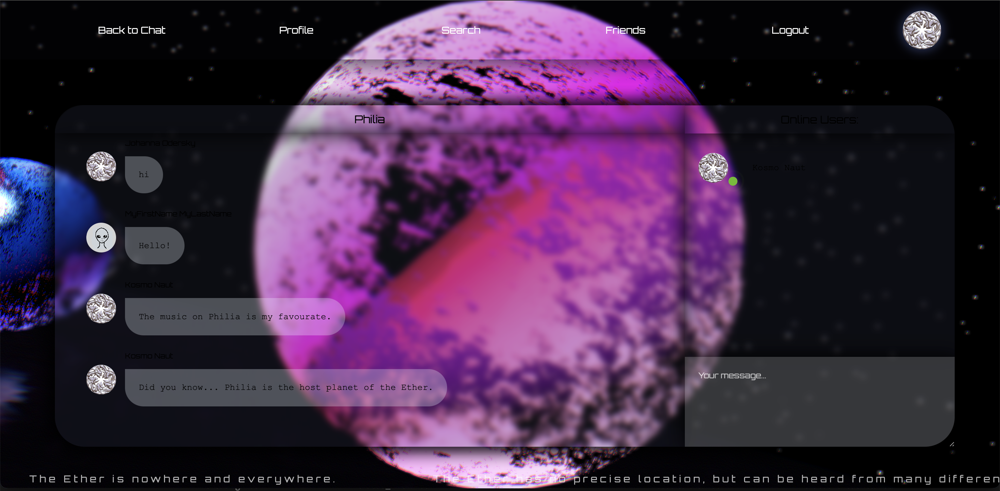
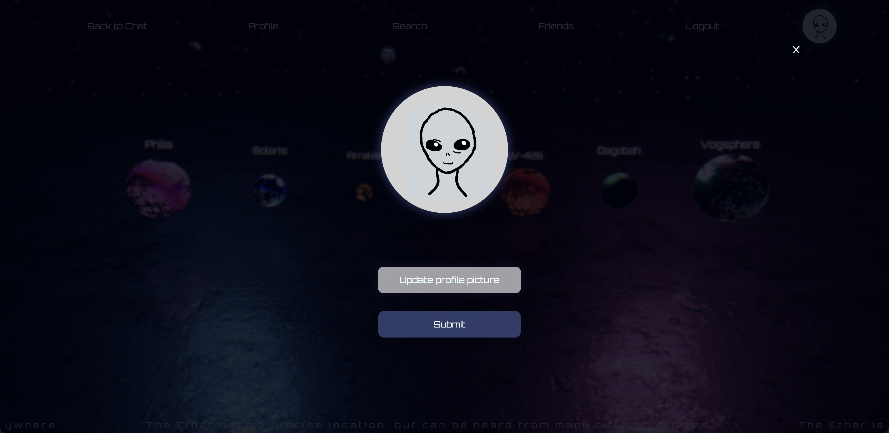
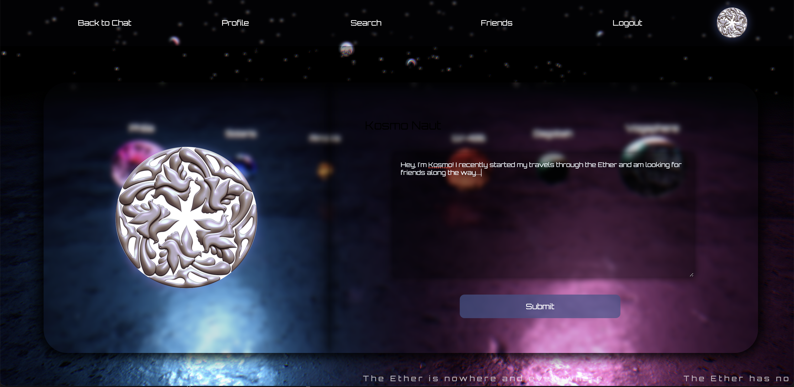

# The Ether

An immersive and interactive 3D Website with web audio and a chat component. Users explore the 3D landscape through touch-based gestures. 

The project features custom made music that is activated through user interaction.

Sign up or log in to the Ether:

Navigate between the different Planets of the either. Each has its own positional soundtrack and a chatroom in which you can interact with other visitors who are currently on the planet:

If close enough to another planet, you will hear it's music in the background. Easily switch between Planets by clicking on them.

Other features include..

..Changing your profile picture:

..Writing a short bio:

..Searching for friends, sending friend requests, accepting or rejecting those friend requests as well as deleting friends.
Between friends one can open a private chat component.

..log out. 

